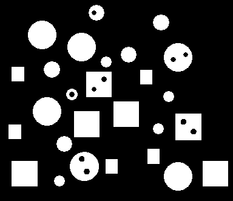

# Centre-of-Gravity

Find each components centre of Gravity

## The input image looks something like this.

## The output Image:

You might notice that these x are a bit to the top right. As you know the OPEN CV put text function starts writing from the bottom left so actually the centre of gravity points are on the left bottom of the image.
