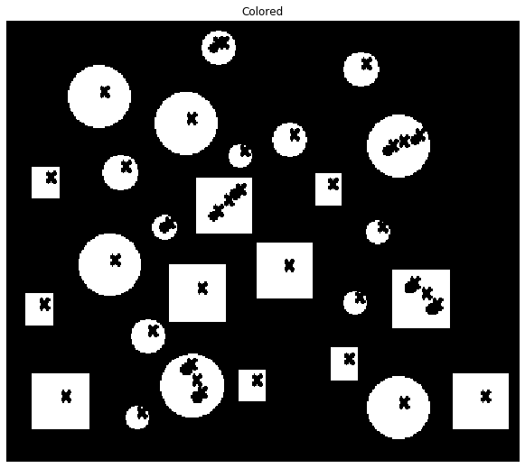

# Centre-of-Gravity

Find each components centre of Gravity

## The input image looks something like this.

## The output Image:

You might notice that these x are a bit to the top right. The centre of gravity is actually on the left bottom of the 'x' drawn.
